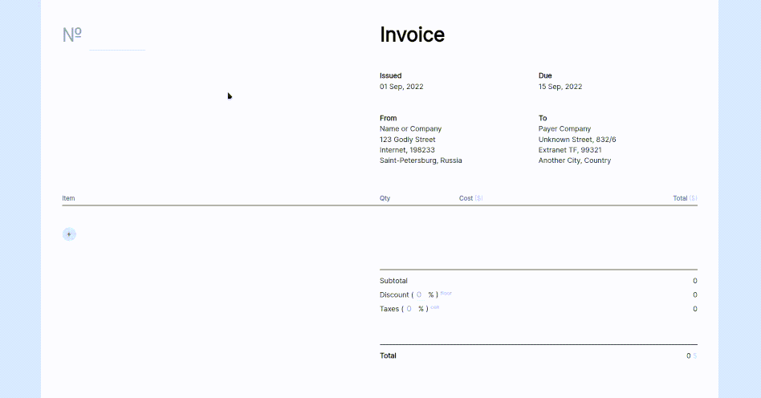

# Invoicee
## Basic Invoice application in pure JavaScript

Try it here: [https://invoicee-three.vercel.app/](https://invoicee-three.vercel.app/)

Replace `Prettier` config in package.json to your own
